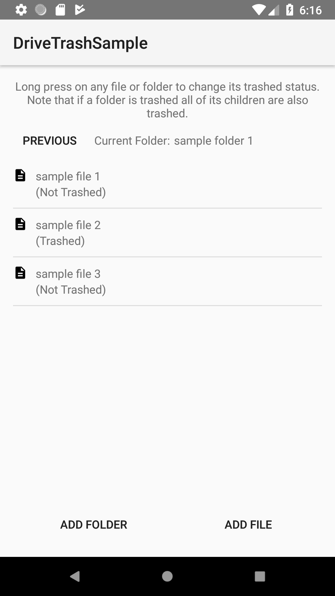

# [DEPRECATED] Google Drive Android API Trash Sample

The Drive Android API used in this sample is now deprecated. Please see the
[migration guide](https://developers.google.com/drive/android/deprecation)
for more information.

---

Google Drive Android API Trash Sample app demonstrates trashing of
DriveResources via the [Google Drive Android API](https://developers.google.com/drive/android/intro)
available in [Google Play Services](http://developer.android.com/google/play-services).
Only DriveResources accessible to an app can be trashed/untrashed. For full API details check
[Google Drive Android API Reference](https://developer.android.com/reference/com/google/android/gms/drive/package-summary.html).

## How to Trash Files

To trash a DriveResource use the trash and untrash methods from the
DriveResourceClient, see guide [here](https://developers.google.com/drive/android/trash).
Trash does not permanently remove the file like delete. The app must have
access to the file or folder to trash. To successfully trash a DriveFolder,
all child resources must be accessible.

## Setup

1. Install the [Android SDK](https://developer.android.com/sdk/index.html).
1. Download and configure the
[Google Play services SDK](https://developer.android.com/google/play-services/setup.html),
which includes the Google Drive Android API.
1. Create [Google API Console](https://console.developers.google.com/projectselector/apis/dashboard)
project and/or enable the Drive API for an existing project.
1. Register an OAuth 2.0 client for the package 'com.google.samples.drive.trash'
with your own [debug keys](https://developers.google.com/drive/android/auth).
See full instructions in the [Getting Started guide](https://developers.google.com/drive/android/get-started).

## Run the Sample

Add DriveFiles or DriveFolders to the currently selected DriveFolder by
clicking the appropriate "ADD" button. Long press on a DriveResource to switch
its trash status. Note that child resources of DriveFolders take on the same
trash state as their parent folder.

